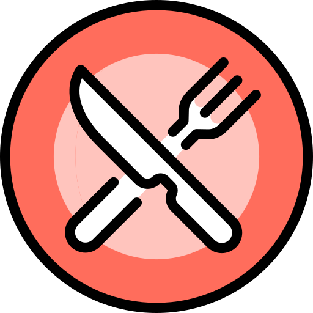
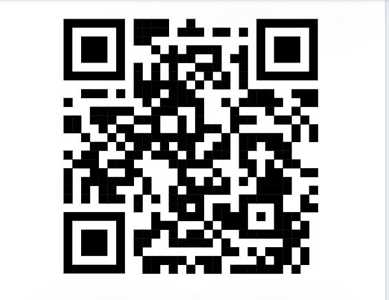
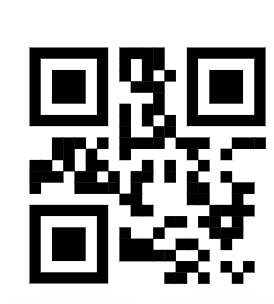
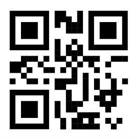
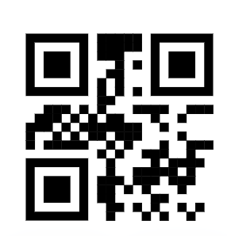
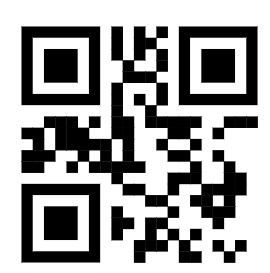
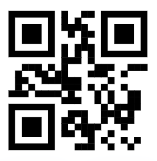
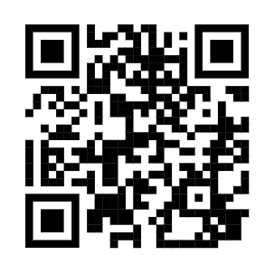

# :fork_and_knife: FFN Restaurante

## :clipboard: Trabajo Práctico Grupal PPS (UTN-Fra) 

### :computer: Integrantes: Franco Sultana, Nicolas Caretti, Federico Dacal

***

## Franco Sultana:
* Diseño Home.
* Alta Cliente. Validar datos.
* Registro mediante lectura QR DNI.
* Listado de productos.
* Consulta al mozo. Respuesta mozo.
* Cliente realiza pedido. Importe y tiempo estimado.
* Mozo entrega pedido y confirmación de cliente. Confirmación de pago.
* Push notification.

## Nicolas Caretti
* Diseño Login.
* Diseño registro cliente anónimo.
* Ingreso cliente anónimo. Login cliente anónimo.
* QR Mesa. Cliente accede al listado de productos para hacer el pedido.
* Confirmación mozo del pedido. Acepta o rechaza pedido.
* Interacción cliente y mozo.
* QR Propina, detalle de la propina y confirmación de pago.
* Push notification.

## Federico Dacal
* Supervisor acepta o rechaza registro.
* Autorización de correos electrónicos del restaurante.
* QR de entrada al local.
* Asignación de mesas por parte del Metre.
* Confirmación del chef y bartender.
* Listado pedido mozo. Verificación estado pedidos.
* Encuesta de satisfacción cliente.
* Gráficos de la encuesta de clientes.
* Push notification.

### :pushpin: Planificación:

***

### :mag_right: Detalles de trabajo semana 1:

:calendar: 03/06/23: 
* El equipo de desarrollo es conformado y se toman decisiones respecto a la metodología de trabajo, entorno de desarrollo, tecnologías y servicios a utilizar y se acuerda el cronograma de actividades de la primera semana para cada programador.
* Decisión del nombre de la empresa/restaurante.
* El entorno de servicios de Firebase se prepara para autentificar usuarios y persistir los datos necesarios.

:calendar: 04/06/23:
* Diseño del tema para la UI.
* Diseño de page Home y Login de prueba.
* Se implementan las funcionalidades para comenzar a logear usuarios y dar de alta a nuevos clientes, con sus respectivos datos.

:calendar: 09/06/23:
* Diseño de page Login para los diferentes perfiles y autenticación de los usuarios.
* Modificaciones en la page Home.
* Desarrollo de funcionalidades específicas para el perfil Supervisor, aceptar o rechazar nuevos clientes.
* Automatización de emails del restaurante hacia los clientes registrados.

:calendar: 10/06/23:
* Modificaciones en page Login 
* Implementación del nuevo Login con 'Cliente anónimo'. Los clientes pueden accede con un perfil anónimo.

***

### :mag_right: Detalles de trabajo semana 2:

:calendar: 13/06/23:
* Generamos QR de entrada del restaurante. El cliente lo escanea para acceder a lista de espera hasta que se le asigne una mesa o el pedido sea rechazado.
* Funcionalidades del perfil Metre, quién debe asignar una mesa a los clientes en espera.

***

### :mag_right: Detalles de trabajo semana 3:

:calendar: 16/06/23:
* Consultas y comunicacion via chat con mozo.
* Relizacion de pedido por el cliente y verificacion en pantalla del mozo.
* Implementacion para que el cliente puede cargar su pedido.

:calendar: 17/06/23:
* Generamos QR de mesa del restaurante. El cliente lo escanea para que el cliente acceda al listado de los productos.
* El cliente realiza el pedido.
* Submenú home.

:calendar: 18/06/23:
* QR Mesa, confirmación mozo y actualización del estado del pedido para la verificación en pantalla del cliente.
* Chef y Bartender confirman que terminaron sus tareas y el pedido esta listo para entregar.
* Diseño page encuesta.

:calendar: 19/06/23:
* El cliente solicita la cuenta.
* QR propina. Mediante un codigo QR el cliente puede realizar un pago de propina.
* Detalle de la propina y confirmación.

:calendar: 20/06/23:
* Encuesta cliente.
* Confirmación del pago por parte del mozo.

:calendar: 21/06/23:
* Modificación del ingreso de cliente anónimo.
* Graficos de las encuentas de clientes.

:calendar: 23/06/23:
* Push notifications.
* Correcciones de diseño.
* Correciones generales.
* Diseño del logo.
* Splash estático y splash dinámico

### :iphone: Códigos QR:

* QR Entrada:

* QR Mesas:
Mesa 1:

Mesa 2:

Mesa 3:

Mesa 4:

Mesa 5:

* QR Propina:

